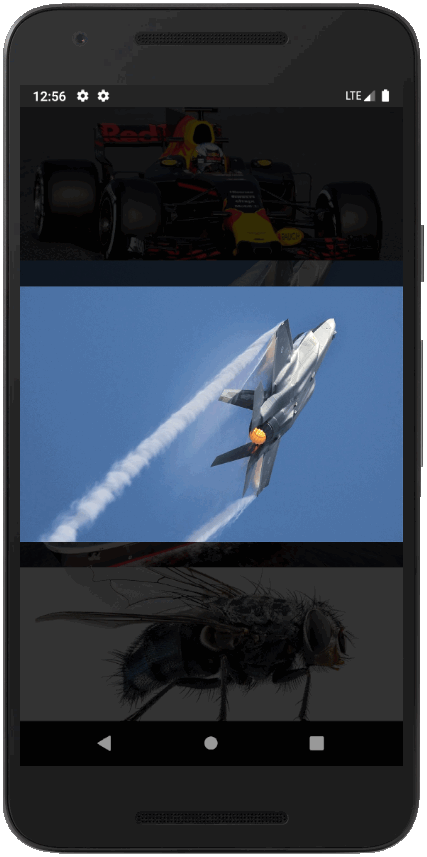

# Flutter Vehicle with Sound App

This flutter app shows serverall images on which can be tabbed.
When tabbed on the image the image wil be shown is a modal and the sound will play. A simple app, but a good example to play sounds, animation and using gesturedetection.

## Getting Started

- git clone
- flutter run

## Enjoy
